# Ex3 - Advanced programing

# Description
This project implements a RESTful web server for a food delivery application built with Node.js and Express, following MVC architecture. The server communicates with the Ex2 TCP server for product view tracking.

# API Endpoints

# Restaurants
| Method | URL | Description |
|--------|-----|-------------|
| GET | /api/restaurants | Get all restaurants |
| POST | /api/restaurants | Create a restaurant |
| GET | /api/restaurants/:id | Get a restaurant by id |
| PATCH | /api/restaurants/:id | Update a restaurant |
| DELETE | /api/restaurants/:id | Delete a restaurant |

# Products
| Method | URL | Description |
|--------|-----|-------------|
| GET | /api/restaurants/:id/products | Get all products |
| POST | /api/restaurants/:id/products | Create a product |
| GET | /api/restaurants/:id/products/:pId | Get a product by id |
| PATCH | /api/restaurants/:id/products/:pId | Update a product |
| DELETE | /api/restaurants/:id/products/:pId | Delete a product |

# Orders
| Method | URL | Description |
|--------|-----|-------------|
| GET | /api/orders | Get all orders of logged in user |
| POST | /api/orders | Create a new order |
| GET | /api/orders/:id | Get an order by id |
| PATCH | /api/orders/:id | Update an order |
| DELETE | /api/orders/:id | Delete an order |

# How to Run
# Prerequisites
- Docker
- Docker Compose

# Build and run all services
docker-compose up --build

This starts two servers:
**Ex2 TCP server** on port 9090
**Ex3 Web server** on port 3000

## Connection to Ex2 Server
When a user views a product (`GET /api/restaurants/:id/products/:pId`), the web server notifies the Ex2 TCP server to record the view:
Tries `PATCH <userId> <productId>` first (existing user)
Falls back to `POST <userId> <productId>` if user does not exist yet

## Branch Structure
`main` → contains Ex3 code (this exercise)
`ex2-submission` → contains Ex2 code (previous exercise, do not modify)

## SOLID Principles

**Single Responsibility:** Each file has one job: models define data, controllers handle HTTP, routes map URLs, services handle external connections.

**Open/Closed:** Adding new endpoints only requires new files: existing code is not modified.

**Dependency Inversion:** Controllers depend on abstractions (model functions, ex2Service) not on direct implementations.

**Loose Coupling:** The Ex2 TCP connection is isolated in `services/ex2Service.js` — if the connection changes, only that file needs updating.

## Example Run:

1. Execute user creation request: POST
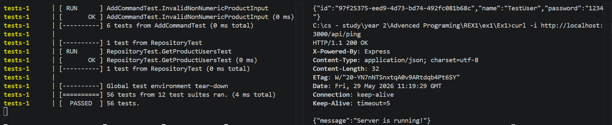

2. Verify that the server is listening
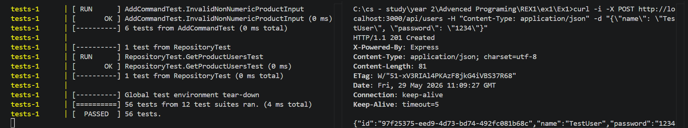

3. Perform user registration
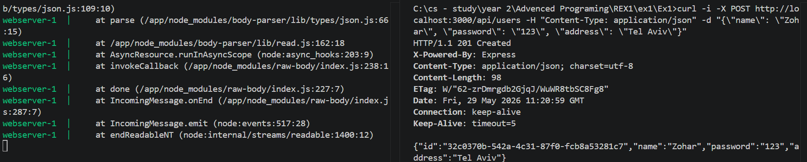

4. Login: receiving a user token
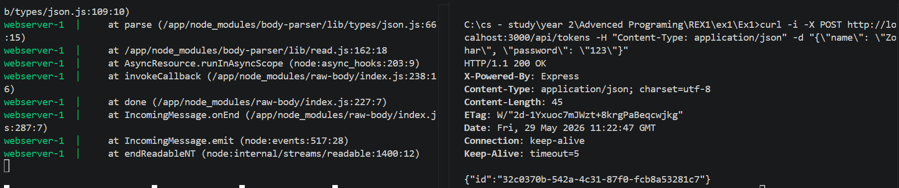

5. Creating a new restaurant:
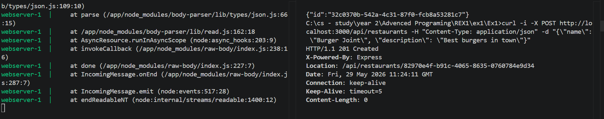

6. Printing all restaurants:
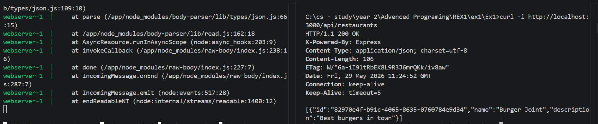

7. Updating a restaurant:
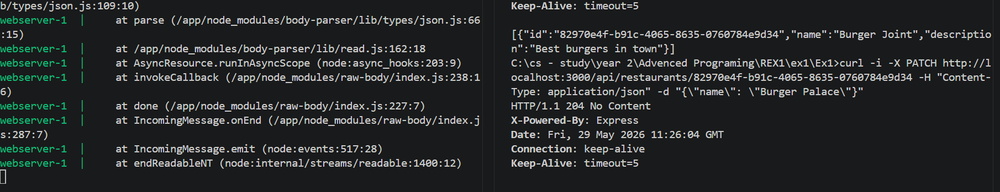

8. Adding a product:
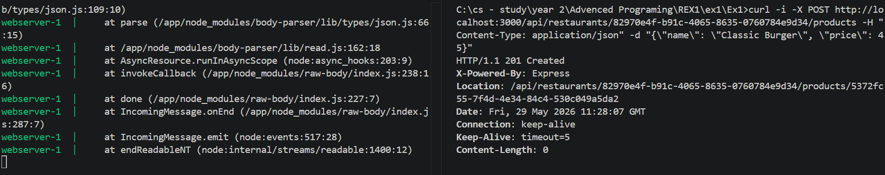

9. Getting the menu:
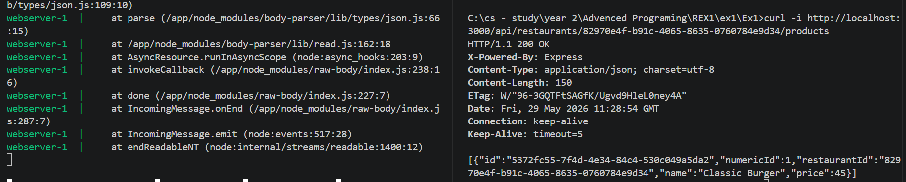

10. Creating an order:
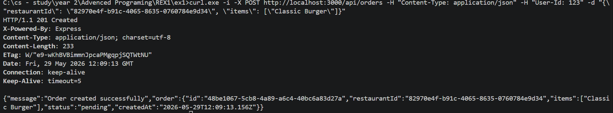

11. Searching for a restaurant or product:
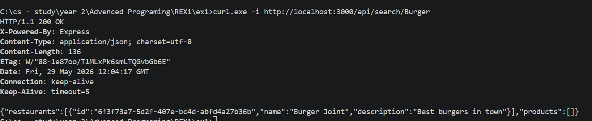

