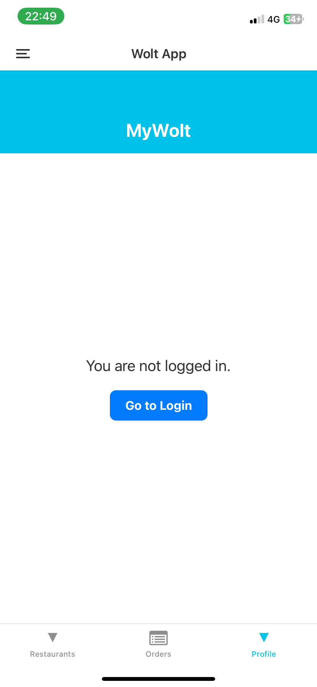
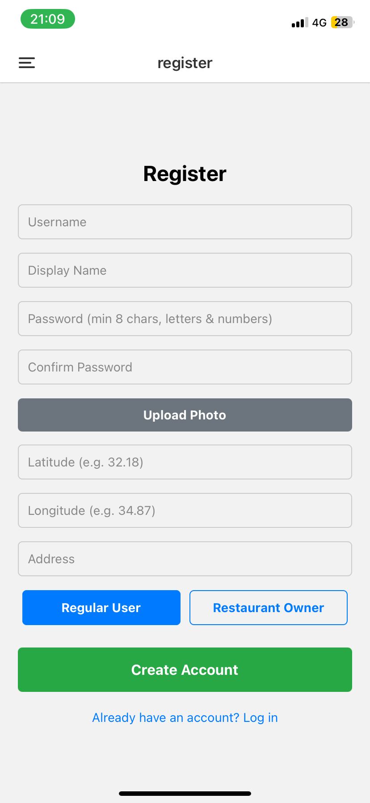
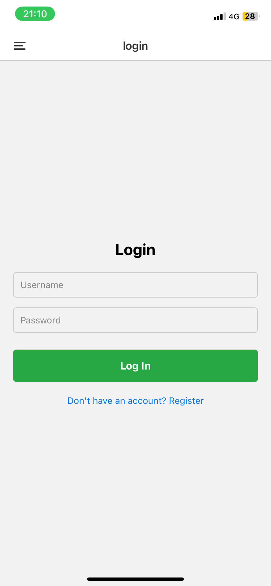
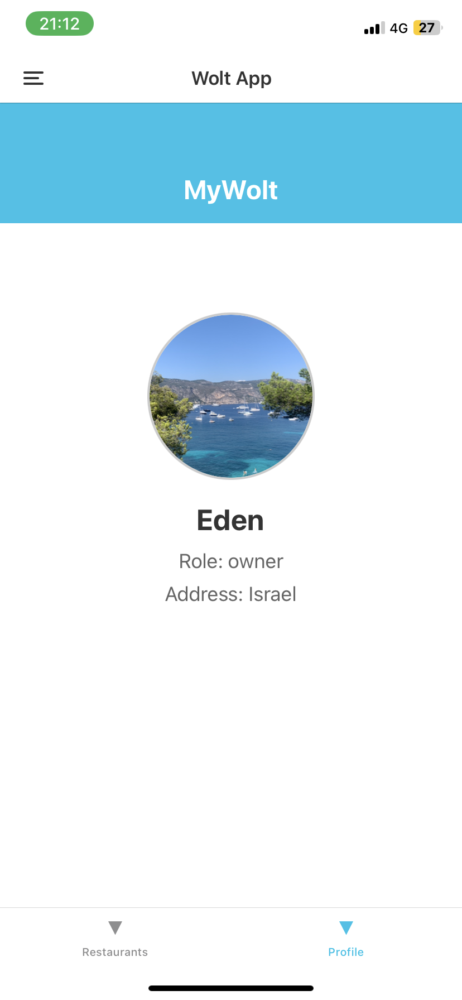

# Authentication & User Management

To access the Wolt clone application features, users must be authenticated. Unauthenticated users are prompted to log in:

## 1. Registration
New users can register by providing their details and selecting their role (Regular User or Restaurant Owner).

## 2. Login
Existing users can log in using their credentials.

## 3. User Profile
Upon successful login, users can view their profile, which displays their assigned role (e.g., owner) and details.

