# Client Operations & Features

This section covers the core functionality of the application from both the customer and the restaurant owner perspectives.

## Customer Flow: Browsing & Ordering

### 1. Home Screen
The main dashboard allows users to browse food categories and view recommended restaurants.

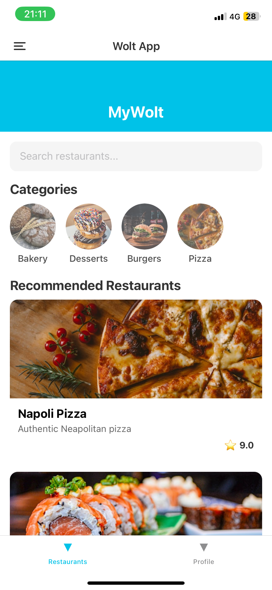

### 2. Viewing a Restaurant Menu
Selecting a restaurant displays its details and menu items. Users can add specific dishes to their cart.

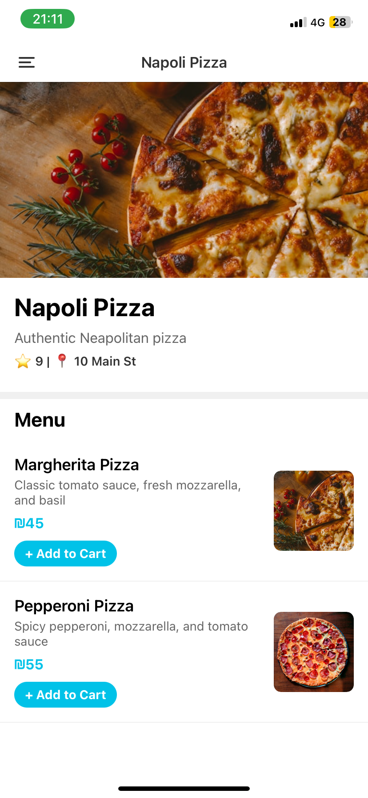

### 3. Cart Management
Users can access their cart at any time.
If no items have been added:

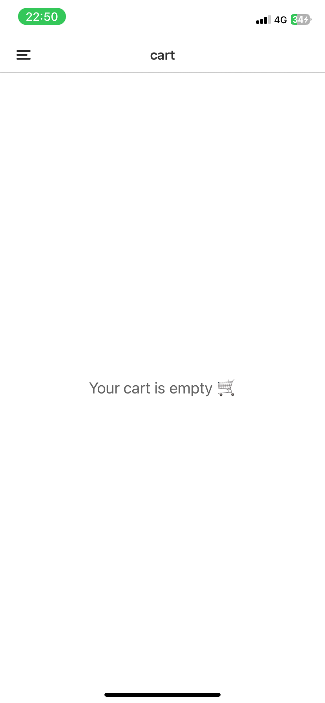

Once items are added, the cart calculates the total price and allows the user to proceed to checkout:

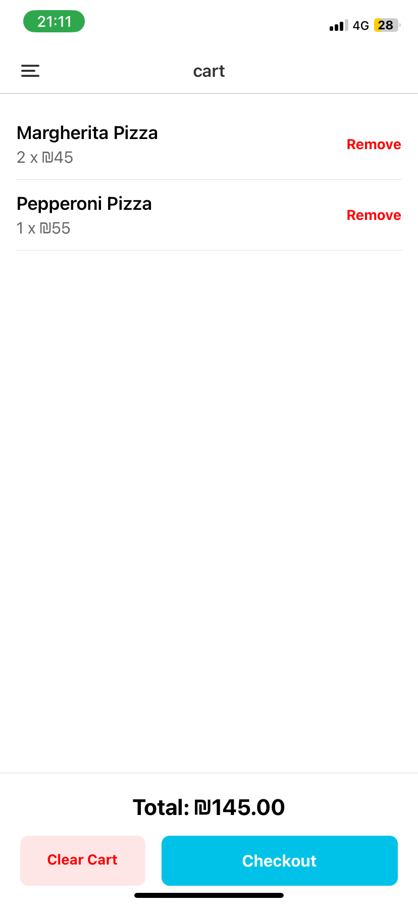

### 4. Order Confirmation
After successful checkout, an order receipt is generated with a unique Order ID and confirmation status.

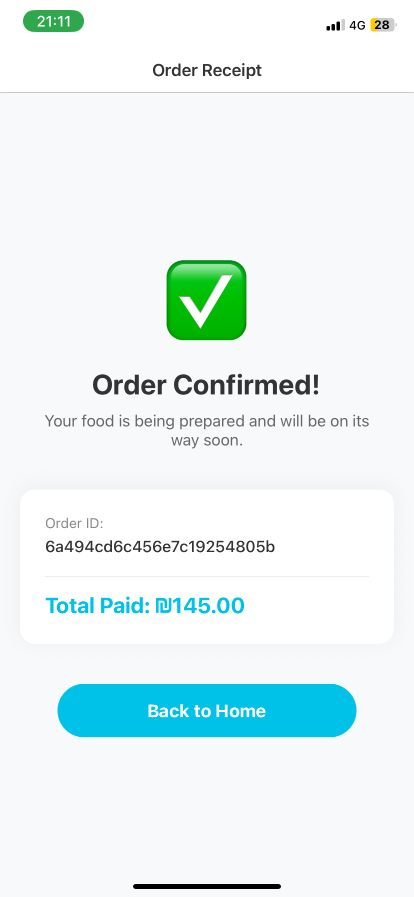

### 5. Order History & Tracking
Users can navigate to the Orders tab to view their past and current orders. This screen displays the order status, total price, and allows users to rate the restaurant.

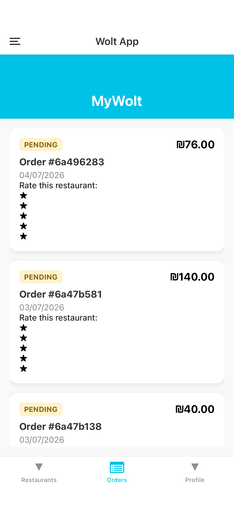

By clicking on a specific order, users can access the Order Details screen, which provides a breakdown of the specific items ordered, the exact timestamp, and the final price.

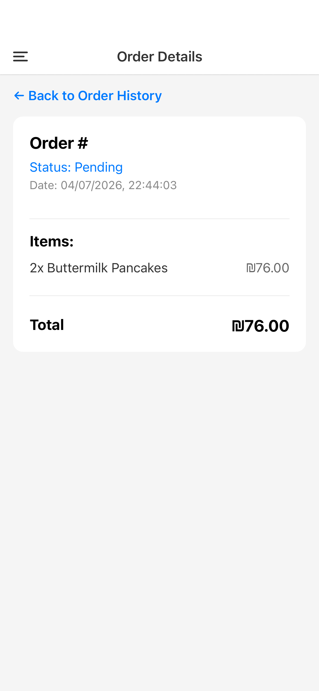

order history by different client:

 ### 6. Role-Based Access (Customer Menu)
The application enforces strict role-based access. Regular customers have a restricted navigation menu containing only standard features (Home, Cart, and Authentication). They do not have the ability to view the management dashboard, add, or edit any restaurant details. 

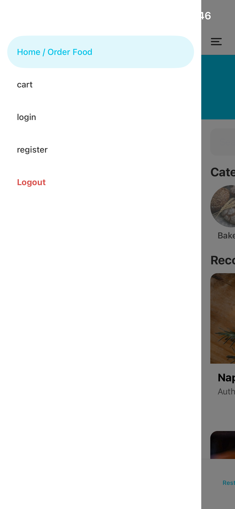
---

## Owner Flow: Restaurant Management (CRUD)

Users with the **Owner** role have access to an administrative dashboard to manage their businesses.

### 1. The Manager Dashboard
Owners can view all their properties and manage them from a centralized list.

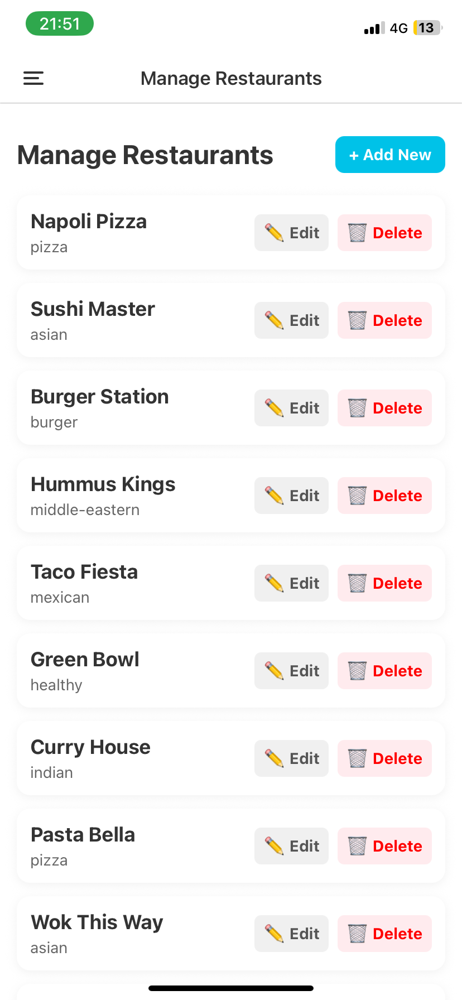

### 2. Adding a New Restaurant
Owners can dynamically add a new restaurant to the platform by providing details such as name, cuisine type, address, and coordinates.

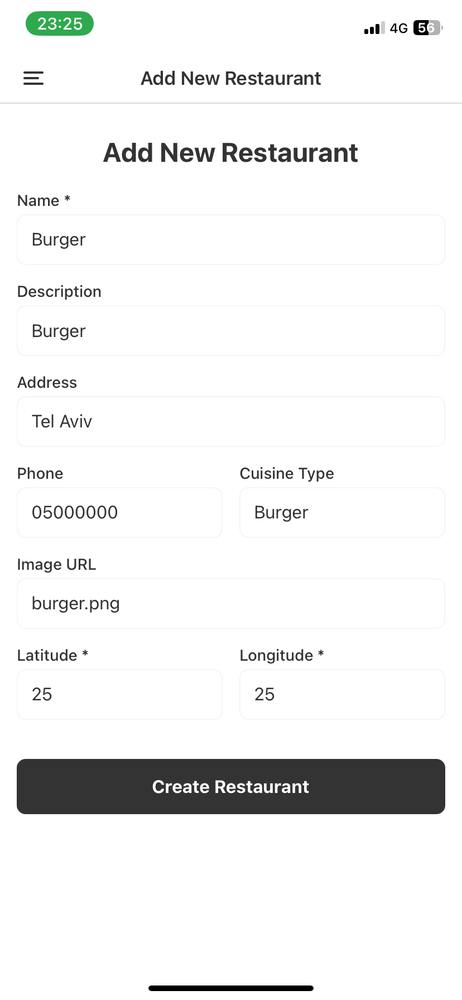

Once successfully created, the new restaurant immediately appears in the management list.

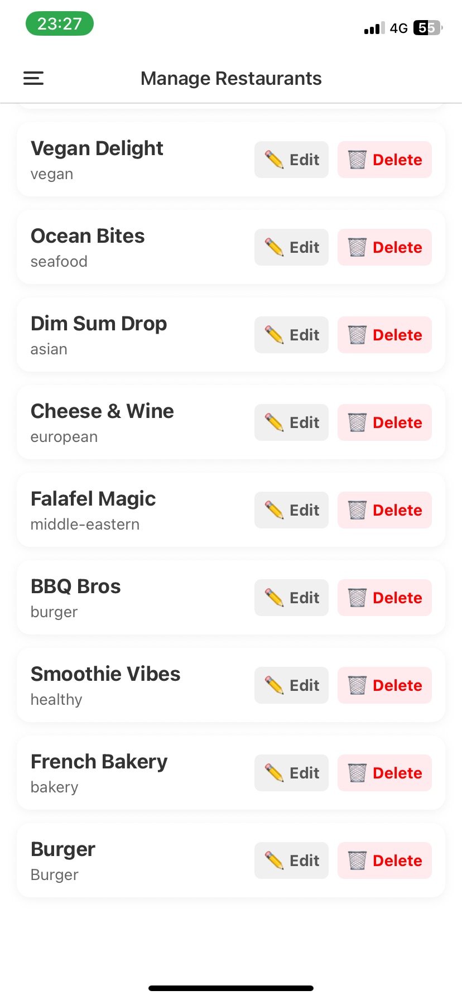

### 3. Editing an Existing Restaurant
By clicking "Edit" on any restaurant, owners can update its properties, change its description, or proceed to manage its specific menu items.

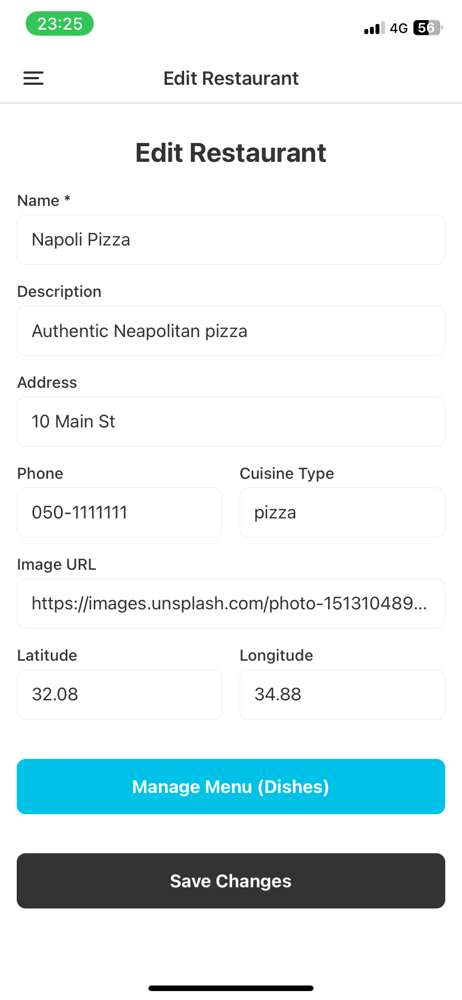

 For example, modifying the restaurant's name:

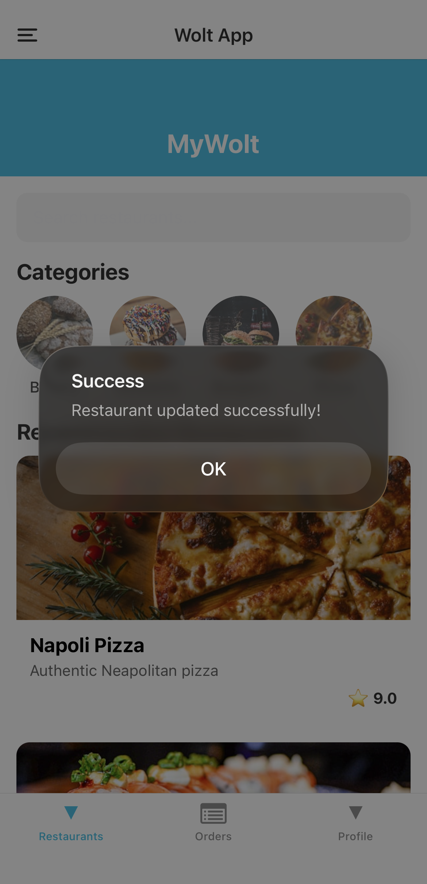

Upon saving, a success confirmation is displayed:

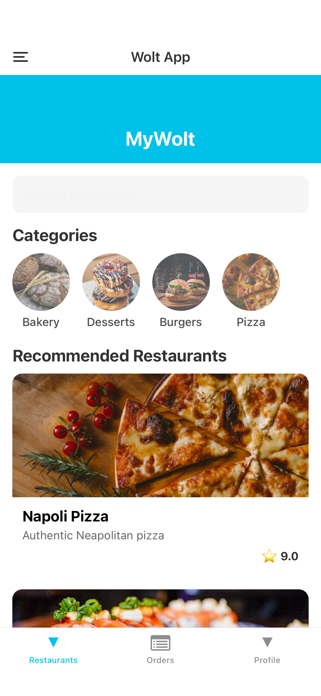

The changes are immediately reflected across all client views. The manager's dashboard updates instantly:

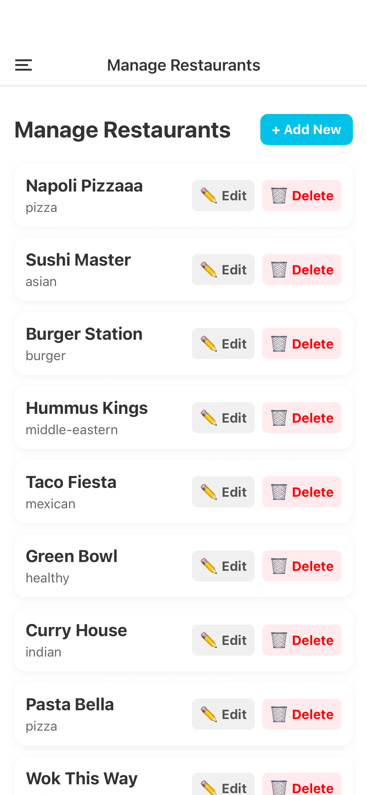

Customers will also dynamically see the updated details on the home screen and inside the restaurant's menu:

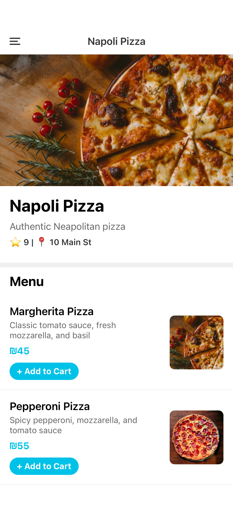

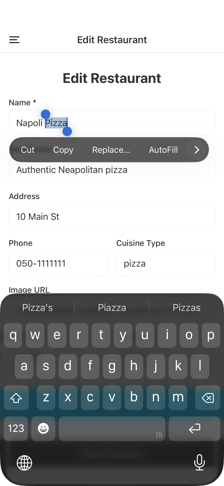